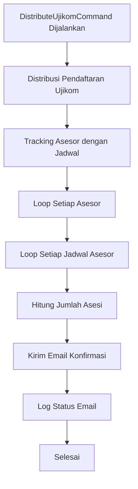

# Fitur Email Konfirmasi Kehadiran - DistributeUjikomCommand

## Deskripsi
Fitur ini menambahkan kemampuan untuk mengirim email konfirmasi kehadiran ke asesor secara otomatis setelah proses distribusi ujikom selesai. Asesor akan menerima email yang berisi detail jadwal ujian dan instruksi untuk konfirmasi kehadiran.

## Fitur Utama

### 1. Email Konfirmasi Kehadiran Otomatis
- **Trigger**: Setelah distribusi ujikom selesai
- **Penerima**: Semua asesor yang ditugaskan
- **Konten**: Detail jadwal, jumlah asesi, dan instruksi konfirmasi

### 2. Template Email yang Informatif
- **Header**: Desain yang menarik dengan warna biru
- **Detail Jadwal**: Skema, TUK, tanggal ujian, jumlah asesi
- **Tombol Aksi**: Link langsung ke halaman verifikasi peserta
- **Instruksi Lengkap**: Langkah-langkah konfirmasi kehadiran

### 3. Tracking Asesor dan Jadwal
- **Tracking per Asesor**: Mencatat jadwal yang ditugaskan ke setiap asesor
- **Email per Jadwal**: Setiap asesor menerima email terpisah untuk setiap jadwal
- **Jumlah Asesi**: Menampilkan jumlah asesi yang ditugaskan

## File yang Dimodifikasi/Dibuat

### Commands
- `app/Console/Commands/DistributeUjikomCommand.php` ✅
  - Menambahkan dependency injection EmailService
  - Menambahkan tracking asesor dengan jadwal
  - Menambahkan method `sendConfirmationEmailsToAsesor()`

### Services
- `app/Services/EmailService.php` ✅
  - Method `sendKonfirmasiKehadiranEmail()`: Kirim email konfirmasi kehadiran

### Mail Classes
- `app/Mail/KonfirmasiKehadiranMail.php` ✅: Mail class untuk konfirmasi kehadiran

### Email Templates
- `resources/views/emails/konfirmasi-kehadiran.blade.php` ✅: Template email konfirmasi kehadiran

### Testing Commands
- `app/Console/Commands/TestKonfirmasiKehadiranEmailCommand.php` ✅: Command untuk testing email

## Alur Kerja



## Cara Penggunaan

### 1. Menjalankan Command
```bash
php artisan ujikom:distribute
```

### 2. Proses Otomatis
- Command akan mendistribusikan pendaftaran ujikom
- Setelah distribusi selesai, email konfirmasi otomatis dikirim
- Asesor menerima email dengan detail jadwal dan instruksi

### 3. Testing Email
```bash
php artisan test:konfirmasi-kehadiran-email your-email@example.com
```

## Output Command

### Distribusi Ujikom
```
Memulai distribusi ujikom...
Ditemukan 10 pendaftaran untuk didistribusikan.
Ditemukan 3 asesor yang tersedia.
Memproses skema ID: 1
Skema 1: 10 pendaftaran akan dibagi ke 3 asesor (4 per asesor)
Distribusi selesai! Total 10 pendaftaran ujikom berhasil dibuat.
```

### Email Konfirmasi
```
Mengirim email konfirmasi kehadiran ke asesor...
✅ Email konfirmasi terkirim ke John Doe untuk jadwal Skema A - TUK Jakarta
✅ Email konfirmasi terkirim ke Jane Smith untuk jadwal Skema B - TUK Bandung
Total 5 email konfirmasi kehadiran berhasil dikirim ke asesor.
```

## Template Email

### Header
- Warna biru (#007bff)
- Judul "Konfirmasi Kehadiran - Ujian Kompetensi"
- Icon 📋

### Konten
- Salam personal dengan nama asesor
- Detail jadwal ujian (skema, TUK, tanggal, jumlah asesi)
- Tombol aksi untuk konfirmasi
- Instruksi langkah-langkah
- Informasi penting

### Footer
- Disclaimer email otomatis
- Copyright sistem

## Konfigurasi

### Email Configuration
Pastikan konfigurasi email di `.env` sudah benar:

```env
MAIL_MAILER=smtp
MAIL_HOST=your-smtp-host
MAIL_PORT=587
MAIL_USERNAME=your-email
MAIL_PASSWORD=your-password
MAIL_ENCRYPTION=tls
MAIL_FROM_ADDRESS=your-email
MAIL_FROM_NAME="Sistem Sertifikasi Kompetensi"
```

### Schedule (Opsional)
Tambahkan ke `app/Console/Kernel.php` untuk menjalankan otomatis:

```php
protected function schedule(Schedule $schedule)
{
    $schedule->command('ujikom:distribute')
             ->dailyAt('09:00')
             ->withoutOverlapping();
}
```

## Error Handling

### Validasi Data
- Cek keberadaan asesor dan email
- Cek keberadaan jadwal
- Cek jumlah asesi yang valid

### Logging
- Log sukses pengiriman email
- Log error jika gagal mengirim
- Log jumlah total email terkirim

### Exception Handling
- Try-catch untuk setiap pengiriman email
- Continue jika satu email gagal
- Tidak menghentikan proses distribusi

## Testing

### Unit Testing
```bash
php artisan test --filter=DistributeUjikomCommand
```

### Email Testing
```bash
php artisan test:konfirmasi-kehadiran-email test@example.com
```

### Manual Testing
1. Jalankan command distribusi
2. Cek email asesor
3. Verifikasi konten email
4. Test link ke sistem

## Troubleshooting

### Email Tidak Terkirim
1. Periksa konfigurasi SMTP
2. Cek log Laravel
3. Test dengan command testing
4. Pastikan asesor memiliki email

### Command Error
1. Periksa dependency injection
2. Cek model relationships
3. Verifikasi data pendaftaran
4. Cek log command

### Template Error
1. Periksa syntax Blade
2. Cek variable yang digunakan
3. Verifikasi Carbon formatting
4. Test template secara terpisah

## Keamanan

- Validasi email asesor sebelum pengiriman
- Sanitasi data sebelum dikirim ke template
- Logging untuk audit trail
- Error handling yang aman

## Performance

- Batch processing untuk email
- Optimasi query database
- Memory management untuk data besar
- Timeout handling untuk SMTP

## Monitoring

### Metrics
- Jumlah email terkirim
- Jumlah email gagal
- Waktu pengiriman
- Response time SMTP

### Alerts
- Email gagal terkirim
- Command timeout
- Database error
- SMTP connection error 
