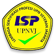

<p align="center">
  
</p>

<p align="center">
  <b>Sistem Informasi Uji Kompetensi & Sertifikasi – LSP UPNVJ</b><br>
  Aplikasi manajemen sertifikasi, ujian kompetensi, dan pelaporan multi–role berbasis Laravel.
</p>

---

## Gambaran Umum Proyek

Aplikasi ini digunakan untuk mengelola seluruh proses sertifikasi di lingkungan LSP UPNVJ, mulai dari:

- **Pendaftaran Uji Kompetensi (Ujikom)** oleh Asesi (mahasiswa/asesi)
- **Manajemen Skema, TUK, Jadwal, Bank Soal, dan Template Dokumen** oleh Admin
- **Proses penilaian & verifikasi** oleh Asesor
- **Monitoring & verifikasi pendaftaran** oleh Kaprodi
- **Monitoring kinerja & laporan IKU** oleh Pimpinan
- **Konfirmasi jadwal & monitoring pelaksanaan** oleh Kepala TUK

Aplikasi dibangun dengan **Laravel** dan memanfaatkan:

- Blade component untuk tampilan modular
- Eloquent ORM untuk akses database
- Chart.js untuk visualisasi dashboard
- PhpSpreadsheet untuk export laporan ke Excel

---

## Fitur Utama

- **Manajemen Skema & TUK**
  - CRUD Skema Sertifikasi
  - CRUD Tempat Uji Kompetensi (TUK)

- **Pendaftaran & Ujikom**
  - Pendaftaran ujikom oleh Asesi
  - Verifikasi berjenjang oleh Kaprodi & Admin
  - Penjadwalan ujian & asignasi asesor

- **Bank Soal & Template Master**
  - Bank soal per skema & tipe formulir (APL, AK, dsb.)
  - Template Master dokumen sertifikasi (Word / PDF)
  - Validasi kombinasi unik (Skema, Tipe, Target/Formulir)

- **Dashboard Multi–Role**
  - Admin, Asesi, Asesor, Kaprodi, Pimpinan, dan TUK memiliki dashboard masing‑masing
  - Grafik Bar & Line untuk tren pendaftaran, workload asesor, top skema, dll.
  - Pie chart untuk segmentasi jenis kelamin, status pendaftaran, dan metrik lain yang cocok

- **Laporan & Export Excel**
  - Report Hasil Ujikom (Kaprodi)
  - Report Pimpinan + laporan detail kompeten/tidak kompeten
  - Laporan IKU 2 dengan filter tanggal & skema
  - Export Excel di setiap laporan (mengikuti filter yang sedang aktif)

---

## Teknologi & Prasyarat

- **PHP** >= 8.1
- **Composer**
- **MySQL/MariaDB**
- **Node.js & NPM/Yarn** (untuk asset build, jika diperlukan)
- **Extensions PHP** standar Laravel (mbstring, openssl, pdo, tokenizer, xml, ctype, json, gd, dll.)

---

## Cara Menjalankan Proyek (Local Development)

### 1. Clone Repository

```bash
git clone <url-repo-ini>
cd sijikomkom
```

### 2. Install Dependency PHP

```bash
composer install
```

Jika menggunakan `sail` atau environment khusus, sesuaikan dengan setup lokal Anda.

### 3. Salin & Konfigurasi File Environment

```bash
cp .env.example .env
```

Ubah konfigurasi dasar di `.env`:

- **Database**

```env
DB_CONNECTION=mysql
DB_HOST=127.0.0.1
DB_PORT=3306
DB_DATABASE=sijikomkom
DB_USERNAME=root
DB_PASSWORD=your_password
```

- **App URL (penting untuk storage dan asset)**

```env
APP_URL=http://127.0.0.1:8000
```

### 4. Generate APP_KEY

```bash
php artisan key:generate
```

### 5. Jalankan Migrasi & Seeder

```bash
php artisan migrate --seed
```

Seeder akan mengisi data awal seperti:

- Role pengguna (admin, asesi, asesor, kaprodi, pimpinan, tuk)
- Skema contoh, jadwal ujikom contoh, dan data sistem lainnya (tergantung seeder yang tersedia)

> Jika ada seeder khusus (misal `SystemAnalystBankSoalSeeder`), jalankan manual:
>
> ```bash
> php artisan db:seed --class=SystemAnalystBankSoalSeeder
> ```

### 6. Link Storage (Jika ada upload file)

```bash
php artisan storage:link
```

### 7. Jalankan Server

```bash
php artisan serve
```

Akses aplikasi di browser:

```text
http://127.0.0.1:8000
```

---

## Akun & Role Default (Contoh)

> **Catatan:** Sesuaikan dengan isi seeder di project Anda.

Beberapa role yang digunakan:

- **Admin**
- **Asesi**
- **Asesor**
- **Kaprodi**
- **Pimpinan**
- **Kepala TUK**

Jika di seeder sudah disiapkan user default, biasanya menggunakan pola:

- Email: `admin@example.com`, `kaprodi@example.com`, dsb.
- Password: `password` atau yang diatur di seeder.

Periksa isi folder `database/seeders` untuk detail terbaru akun default.

---

## Struktur Folder Penting

- `app/Http/Controllers`
  - `Admin/` – Manajemen skema, TUK, bank soal, template, dll.
  - `Asesi/` – Pendaftaran ujikom, sertifikasi, upload dokumen.
  - `Asesor/` – Review APL, penilaian, hasil ujikom.
  - `Kaprodi/` – Dashboard kaprodi, verifikasi pendaftaran, report hasil ujikom.
  - `Pimpinan/` – Dashboard pimpinan, report pimpinan, laporan IKU.
  - `Tuk/` – Dashboard TUK & konfirmasi jadwal.

- `resources/views/components/pages`
  - Folder per role (`admin`, `asesi`, `asesor`, `kaprodi`, `pimpinan`, `tuk`)
  - Setiap halaman menggunakan komponen Blade terstruktur.

- `app/Traits/MenuTrait.php`
  - Menyusun struktur sidebar/menu untuk setiap role.

- `app/Services` / `app/Console/Commands`
  - Service khusus & command artisan untuk pengelolaan background task (jika ada).

---

## Testing (Opsional)

Jika Anda menambahkan test, jalankan dengan:

```bash
php artisan test
```

Atau dengan PHPUnit langsung:

```bash
./vendor/bin/phpunit
```

---

## Style & Kontribusi Kode

- Ikuti **coding style Laravel** (PSR-12).
- Gunakan **Form Request** & validasi sisi server untuk setiap form penting.
- Manfaatkan **Blade component** dan partial view untuk menghindari duplikasi.
- Untuk fitur baru:
  - Tambah route di `routes/web.php` dengan prefix & middleware yang sesuai role.
  - Tambah controller di namespace role yang tepat.
  - Tambah tampilan di `resources/views/components/pages/{role}`.

Jika bekerja secara tim, sebaiknya gunakan:

- Branch per fitur (`feature/nama-fitur`)
- Pull Request dengan deskripsi singkat perubahan

---

## Lisensi

Proyek ini dibangun di atas framework **Laravel** yang berlisensi [MIT](https://opensource.org/licenses/MIT).  
Lisensi spesifik aplikasi ini mengikuti kebijakan internal LSP UPNVJ (atur sesuai kebutuhan organisasi).

