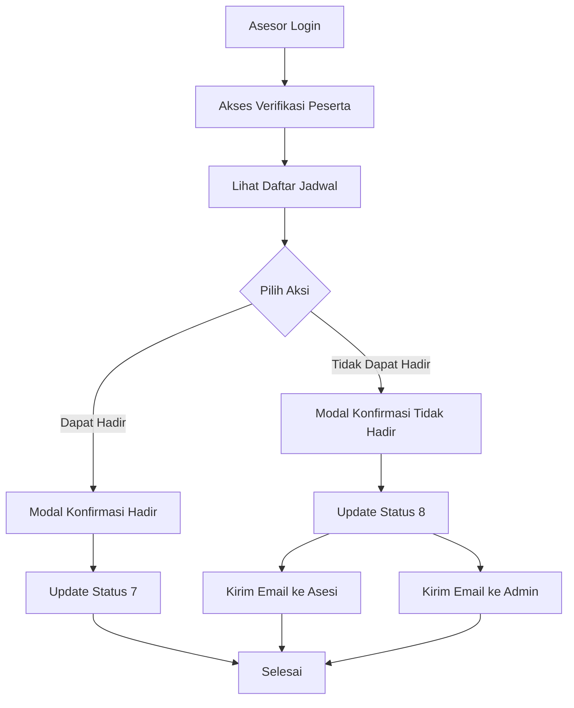

# Fitur Verifikasi Peserta - Asesor

## Deskripsi
Fitur ini memungkinkan asesor untuk melihat jadwal ujian yang ditugaskan kepada mereka dan melihat detail asesi yang akan diuji.

## Fitur Utama

### 1. List Jadwal Ujian
- Menampilkan daftar jadwal ujian yang ditugaskan kepada asesor yang login
- Data diambil dari tabel `pendaftaran_ujikom` dengan `asesor_id` sesuai user yang login
- Menampilkan informasi: Skema, TUK, Tanggal Ujian, Status

### 2. List Asesi per Jadwal
- Menampilkan daftar asesi untuk jadwal tertentu
- Detail jadwal lengkap (skema, TUK, tanggal, kuota, jumlah asesi)
- Informasi asesi: nama, NIM, telepon, status, keterangan

## File yang Dibuat/Dimodifikasi

### Controller
- **File**: `app/Http/Controllers/Asesor/VerifikasiPesertaController.php`
- **Method**:
  - `index()` - List jadwal
  - `showAsesi($jadwalId)` - List asesi per jadwal
  - `updateStatus()` - Menangani update status kehadiran
  - `sendNotificationEmails()` - Mengirim email notifikasi

### Views
- **File**: `resources/views/components/pages/asesor/verifikasi-peserta/list.blade.php`
  - Diupdate untuk menampilkan list jadwal
- **File**: `resources/views/components/pages/asesor/verifikasi-peserta/asesi-list.blade.php`
  - View untuk menampilkan list asesi (read-only)

### Model
- **File**: `app/Models/PendaftaranUjikom.php`
  - Diupdate relasi untuk membedakan asesi dan asesor
- **File**: `app/Models/Jadwal.php`
  - Menambahkan status 7 dan 8

### Routes
- **File**: `routes/web.php`
  - Route untuk show asesi
  - Route untuk update status dengan method PUT/DELETE

## Status Pendaftaran Ujikom
- **Status 1**: Belum Ujikom
- **Status 2**: Ujikom Berlangsung
- **Status 3**: Ujikom Selesai
- **Status 4**: Tidak Kompeten
- **Status 5**: Kompeten
- **Status 6**: Menunggu Konfirmasi Asesor
- **Status 7**: Asesor Dapat Hadir
- **Status 8**: Asesor Tidak Dapat Hadir

## Cara Penggunaan

### 1. Login sebagai Asesor
- Email: `asesor@test.com`
- Password: `password`

### 2. Akses Menu Verifikasi Peserta
- Klik menu "Verifikasi Peserta" di sidebar asesor
- Akan muncul list jadwal ujian yang ditugaskan

### 3. Lihat List Asesi
- Klik tombol "Lihat Asesi" pada jadwal tertentu
- Akan muncul detail jadwal dan list asesi
- Halaman ini hanya untuk melihat informasi (read-only)

## Workflow

### 1. Asesor Login
- Sistem mengambil `asesor_id` dari user yang login
- Menampilkan jadwal yang ditugaskan kepada asesor tersebut

### 2. Pilih Jadwal
- Asesor memilih jadwal tertentu
- Sistem menampilkan list asesi untuk jadwal tersebut

### 3. Lihat Detail Asesi
- Asesor dapat melihat informasi lengkap asesi
- Informasi yang ditampilkan: nama, NIM, telepon, status, keterangan

## Informasi yang Ditampilkan

### Detail Jadwal
- Skema ujian
- TUK (Tempat Uji Kompetensi)
- Tanggal ujian dan selesai
- Status jadwal
- Kuota dan jumlah asesi

### Detail Asesi
- Nama asesi
- NIM
- Nomor telepon
- Status pendaftaran ujikom
- Keterangan (jika ada)

## UI/UX Features
- **Responsive Design**: Tabel responsive dengan DataTables
- **Status Badge**: Warna berbeda untuk setiap status
- **Clean Layout**: Tampilan yang bersih dan mudah dibaca
- **Search & Filter**: Kemampuan pencarian dan filter data

## Security
- Validasi `asesor_id` untuk memastikan hanya asesor yang berhak
- Hanya menampilkan data yang relevan dengan asesor yang login

## Troubleshooting

### Data tidak muncul
1. Pastikan ada data di tabel `pendaftaran_ujikom`
2. Pastikan `asesor_id` sesuai dengan user yang login
3. Jalankan seeder untuk testing data

### Error saat akses
1. Cek log Laravel: `tail -f storage/logs/laravel.log`
2. Pastikan user memiliki role asesor
3. Pastikan ada jadwal yang ditugaskan kepada asesor

### Tabel tidak responsive
1. Pastikan DataTables CSS dan JS sudah dimuat
2. Cek console browser untuk error JavaScript
3. Pastikan jQuery sudah dimuat sebelum script custom

## Alur Kerja



## Konfigurasi Email

Pastikan konfigurasi email di `.env` sudah benar:

```env
MAIL_MAILER=smtp
MAIL_HOST=your-smtp-host
MAIL_PORT=587
MAIL_USERNAME=your-email
MAIL_PASSWORD=your-password
MAIL_ENCRYPTION=tls
MAIL_FROM_ADDRESS=your-email
MAIL_FROM_NAME="Sistem Sertifikasi Kompetensi"
```

## Testing

### Test Email
Untuk testing email, gunakan Mailtrap atau service email testing lainnya.

### Test Modal
1. Login sebagai asesor
2. Akses halaman verifikasi peserta
3. Cari jadwal dengan status 6
4. Test tombol "Asesor Dapat Hadir" dan "Asesor Tidak Dapat Hadir"
5. Verifikasi modal muncul dan form berfungsi

## Troubleshooting

### Email Tidak Terkirim
1. Periksa konfigurasi SMTP di `.env`
2. Periksa log Laravel di `storage/logs/laravel.log`
3. Pastikan queue worker berjalan jika menggunakan queue

### Modal Tidak Muncul
1. Periksa apakah Bootstrap dan jQuery dimuat
2. Periksa console browser untuk error JavaScript
3. Pastikan data attributes pada tombol sudah benar

### Status Tidak Berubah
1. Periksa apakah route sudah terdaftar dengan benar
2. Periksa apakah method di controller berjalan
3. Periksa log Laravel untuk error

## Keamanan

- Validasi input keterangan untuk ketidakhadiran
- Validasi bahwa asesor terdaftar di jadwal tersebut
- CSRF protection pada form
- Database transaction untuk konsistensi data
